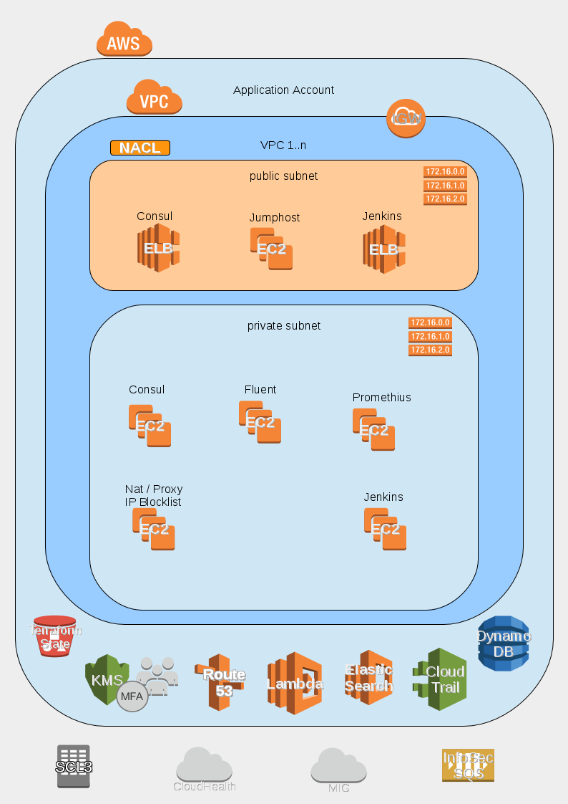
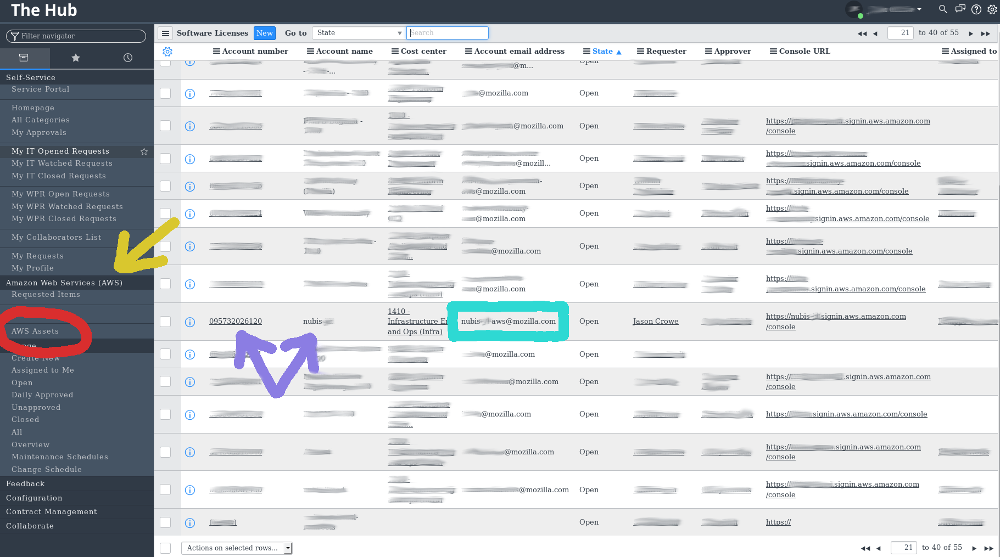
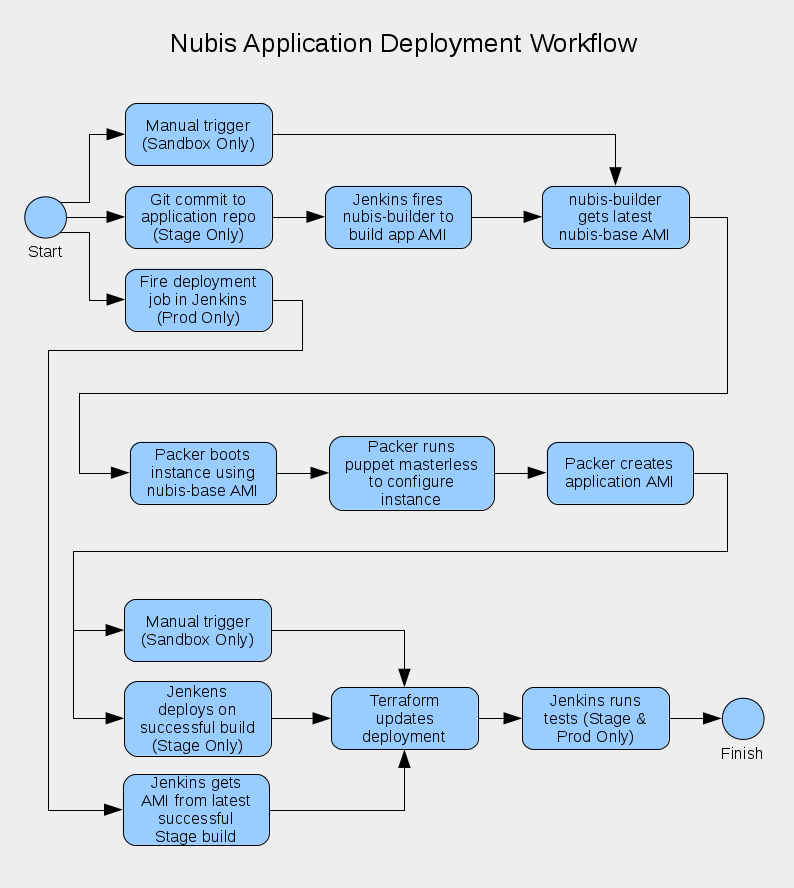



# Deployment Overview

A Nubis Account Deployment consists of a number of standard services and
security integrations. This document provides and overview of the account and
services provided. Each service is self-contained and links are provided to each
services' documentation which details that specific service.

## Nubis Account Diagram



NOTE: Details for the deployment including; naming conventions, relationships,
permissions, etcetera, can be found in the [Terraform template](https://github.com/nubisproject/nubis-deploy/blob/master/main.tf)
used for deployment.

### Services Provided

This is a list of all of the services available in a Nubis Account.

**TODO**: Add missing documentation links

* [VPC](https://github.com/nubisproject/nubis-deploy/blob/master/README.md#vpc-deployment)
* [Consul](https://github.com/nubisproject/nubis-consul/blob/master/README.md#consul-deployment)
* [Jumphost](https://github.com/nubisproject/nubis-jumphost/blob/master/README.md#jumphost-deployment)
* [Fluent](https://github.com/nubisproject/nubis-fluent-collector/blob/master/README.md#fluent-deployment)
* [Opsec / CloudTrail](https://github.com/nubisproject/nubis-deploy/blob/master/README.md#opsec-deployment)
* [CI](https://github.com/nubisproject/nubis-ci/blob/master/README.md#ci-deployment)
* [VPN](https://github.com/nubisproject/nubis-deploy/blob/master/README.md#vpc-deployment)
* User Management
* [NAT / Proxy](https://github.com/nubisproject/nubis-nat/blob/master/README.md#nat-deployment)
* [Prometheus](https://github.com/nubisproject/nubis-prometheus/blob/master/README.md#prometheus-deployment)
* [ELK](https://github.com/nubisproject/nubis-fluent-collector/blob/master/README.md#deployment-notes)

It is important to note that not all services are deployed in every account. To
determine which services are deployed in a specific account you will need to
consult the deployment configuration file for that account. For example, you can
find the configuration files for the Nubis' Teams accounts in the
[nubis-accounts-nubis](https://github.com/nubisproject/nubis-accounts-nubis) repository.

Within each configuration file are a set of feature flags, these flags are used
to enable or disable specific services and are discussed [below](#feature-flags).

### Decryption Keys

You will need your GPG key added to the authorized configuration to view these
files.  [Git-crypt](https://github.com/AGWA/git-crypt) is used to manage encrypting
the files. You will need to contact the team responsible for the deployment
repository to gain decryption abilities.

To determine which team to contact you will need to:

* Log into ServiceNow (The Hub)
* You will need the 'Amazon Web Services (AWS)' module enabled (Yellow Arrow)
* Select 'AWS Assets' (Red Circle)
* Locate the account by name or number (Purple Arrows)
* Locate the 'Account Email Address' (Sea-Green Square)
* Send an email to the address requesting access

**NOTE:** Only Nubis project accounts contain 'nubis' in the name. Application
accounts are named after the deployed application.



### Security Integrations

There are a number of security integrations deployed into a Nubis Account. These
are not available via feature flags and are always deployed in an account. Note
that specific services contain additional security integrations which are
detailed with the documentation for the service.

**TODO**: List security integrations

* SSH security group
* MIG
* NSM
* IP Blocklist
* HTTP(S) Proxy
* Cloud Trail
* ?

### Feature Flags

Within the account deployment variables file are a number of feature flags.
These flags are used to select which services to deploy into the account. For a
complete list of services depoyed into a particular account you will need to
consult that accounts variables file. Here is an example of some of the feature
flags available:

```bash
features.consul = 1
features.jumphost = 1
features.fluent = 1
features.opsec = 1
features.ci = 0
features.stack_compat = 0
features.vpn = 0
features.user_management_consul = 0
```

## Deployment Workflow

All deployment methods use Terraform as the descriptive language. The process
varies somewhat depending on weather you are deploying a Nubis account or an
Application in a Nubis account.

### Account Deployment Workflow

Account deployments are quite simple in practice. To deploy an account you need
access to the encrypted variables file discussed above. You also need to have
admin (*.*) privileges in AWS. The actual deployment is accomplished with
Terraform and is described in greater detail in the
[nubis-deployment repository](https://github.com/nubisproject/nubis-deploy/blob/master/README.md).

### Application Deployment Workflow

Application deployment is a bit more complex. If you are working in a Sandbox
account that you will likely be using a manual process utilizing Terraform. When
working in a production account the deployment is automated by using Jenkins as
the continuous integration (CI) system

The CI system monitors the application's deployment repository hosted in git,
typically GitHub. When a change lands in the repository, CI triggers AMI builds
and (if successful) deploys the new image into the Stage environment (VPC).
Deployment to production is typically triggered manually, through the CI system.
The Prod deployment does not build an AMI, instead it uses the latest
successfully built AMI from the Stage environment. This helps to ensure that
only working AMIs are deployed into production.


