# Nubis-Dpaste Working Lab
In this lab we will walk through cloning the nubis-dpaste repository, making a change and submitting a pull request.

## Fork The nubis-dpaste Repository On GitHub
Head over the the [nubis-dpaste](https://github.com/Nubisproject/nubis-dpaste) repository on GitHub and click the fork button.

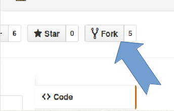

## Clone The Repository Locally
Next we will clone the repository locally. You can copy the url from github and paste it into your terminal.

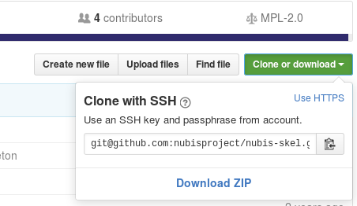

```bash
git clone git@github.com:nubisproject/nubis-dpaste.git
cd nubis-dpaste
```

## Make some local changes
Here we will make a local change. Lets say that the ```apache2ctl graceful``` command is not sufficent to apply our changes. Lets change that to ```apache2ctl restart```.

```bash
vi nubis/puppet/files/update
```

Change ```apache2ctl graceful```

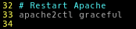

To ```apache2ctl restart```


## Make a Pull Request
Now we want to get our changes accepted upstream so we can get this change into production. We will use a series of git commands to check in our change and submit a pull request.

### Git stauts
Lets check the changes that git is aware of.

```bash
git status
```

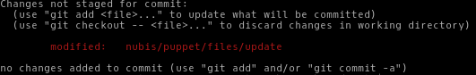

### Git diff
If we would like to double check that we are not including anything unintended in the commit we can look at the diff.

```bash
git diff
```

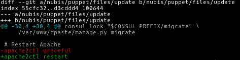

### Git add
The next step is to add the changes we want to include.

```bash
git add nubis/puppet/files/update
```

### Git status
Lets double check what git is going to include in our commit. We can see here that git is only going to include the change we made in this commit.

```bash
git status
```

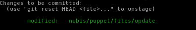

### Git commit
Now that we have added the changed file and verified what we are committing it is time to commit the changes. While it is possible to add a message to the commit command, I encourage you to always add the message through your editor as it gives you one last chance to ensure you are committing what you intended.

Go ahead and add a good commit message like ```Change apache graceful to restart```
```bash
git commit
```

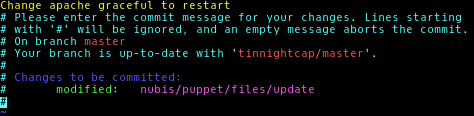

### Git push
Finally it is time to push our local commit to our remote repository. Since we cloned this from our user space on GitHub this will push our changes to the repository hosted there.

```bash
git push
```

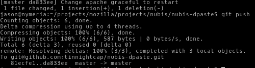

### Create a Pull Request
Now we can head over to GitHub and make a pull request.

#### Load GitHub in your browser
Start by going to your ```nubis-dpaste``` repository on GitHub. For me the url is https://github.com/$GIT_USERNAME/nubis-dpaste, however you will need to change ```$GIT_USERNAME``` to your GitHub user name.

#### GitHub New Pull Request
Click on the ```New Pull Request``` button.

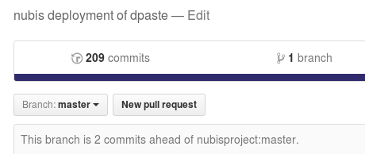

#### GitHub Create Pull Request
This is your final change to review your changes before creating the pull request. You can review all of the changes to all of the files that are going to be included. Once you have ensured that everything looks good, go ahead and click on the ```Create Pull Request``` button.

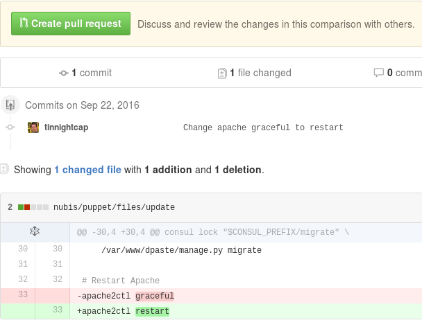

### Code Review
Once that is complete, anyone with admin privileges on the original repository will be able to merge your pull request. At this point they may; make comments and ask you to make changes, reject the pull request, or simply ```r+``` and merge in your changes.

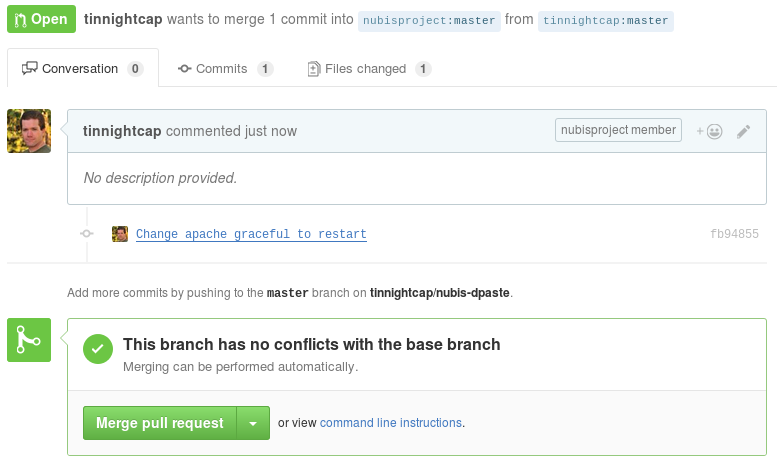

## Clean up
Since this is just an example and we do not want to actually make this change, lets go ahead and reset to a clean state.

This will reset your repository to the state it was in before the last commit. If you wish to remove the commit but leave the changed files in a ```"Changes to be committed"``` state you can use the ```--soft``` option in place of ```--hard```. The ```HEAD~1``` portion tells git to go back one commit from the tip of the repository.

```bash
git reset --hard HEAD~1
```

Finally, go ahead and push this up to your fork on GitHub.

**NOTE:** You do not want to normally remove commits from a public repository. This is especially important if anyone has forked your repository. In this case it should be safe since no one should have forked your repository yet. **Use Caution**
```bash
git push -f
```

## FIN
That is the end of this lab. If you have any questions do not hesitate to reach out to us on ```irc.mozilla.org #nubis-users```.
