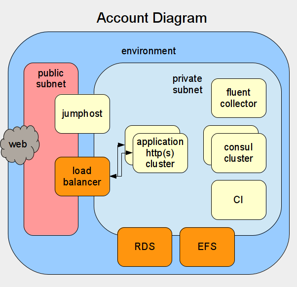
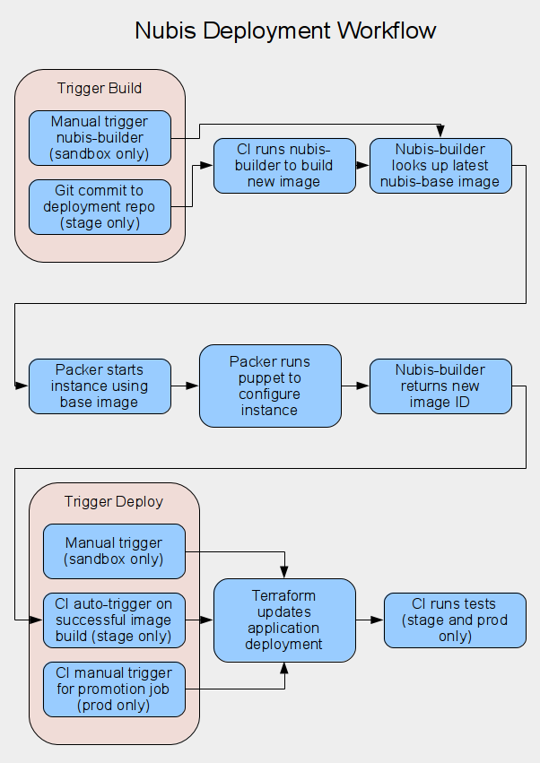
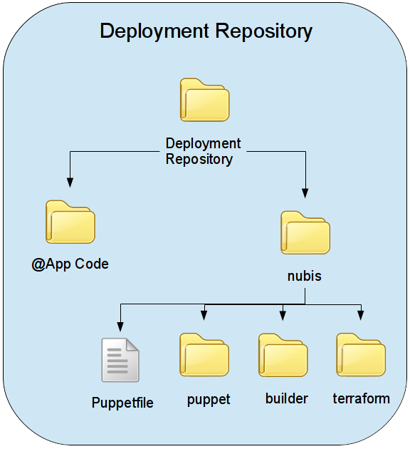
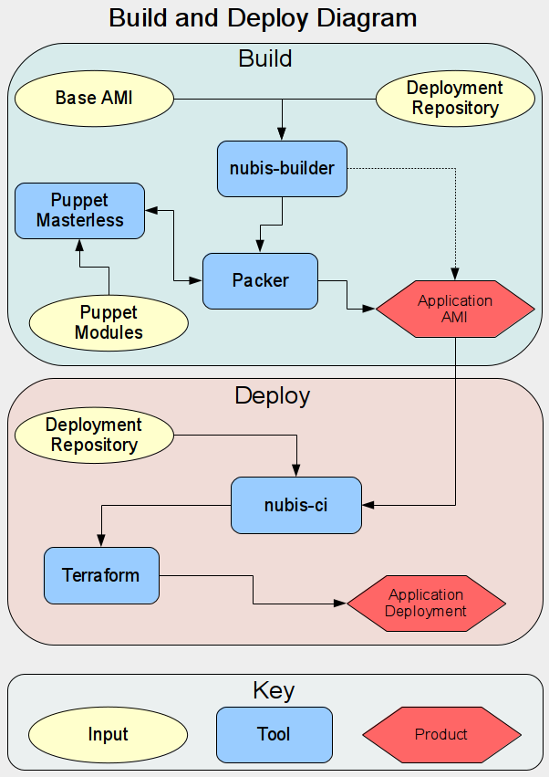

# Nubis Overview
It is time to move past ideas and start talking about the project we are working on to help us with our transition into the cloud.

 - [What is Nubis](#what-is-nubis)
  - [Standardized design](#standardized-design)
  - [Security compliance](#security-compliance)
  - [Reduced time-to-market](#reduced-time-to-market)
 - [What can Nubis do for me](#what-can-nubis-do-for-me)
 - [What does Nubis provide](#what-does-nubis-provide)
  - [Nubis accounts](#nubis-accounts)
     - [Accounts](#accounts)
         - [Multiple environments](#multiple-environments)
      - [Quarterly Updates](#quarterly-updates)
         - [Distribution upgrades](#distribution-upgrades)
         - [Package updates](#package-updates)
         - [New services](#new-services)
         - [Application Image Updates](#application-image-updates)
      - [Security Updates](#security-updates)
      - [Included Services](#included-services)
         - [Proxies](#proxies)
         - [NATs](#nats)
         - [Consul Integration](#consul-integration)
         - [Fluent Integration](#fluent-integration)
         - [Jumphosts](#jumphosts)
      - [User Management](#user-management)
         - [MFA](#mfa)
         - [aws-vault](#aws-vault)
         - [LDAP Integration](#ldap-integration)
      - [Security Integration](#security-integration)
         - [InfoSec security audit role](#infoSec-security-audit-role)
         - [Network Security Monitoring](#network-security-monitoring) (NSM)
         - [Integrated IP Blacklisting](#integrated-ip-blacklisting)
         - [Log Integration with Mozilla Investigator](#log-integration-with-mozilla-investigator) (MIG)
         - [CloudTrail Integration](#cloudtrail-integration)
      - [Additional Services](#additional-services)
         - [Cloud Health Integration](#cloud-health-integration)
         - [Billing Support](#billing-support)
         - [Tainted Resources](#tainted-resources)
         - [Platform Monitoring](#platform-monitoring)
         - [High Availability](#high-availability)
  - [Nubis deployments](#nubis-deployments)
      - [Deployment Overview](#deployment-overview)
         - [Environments and how to use them](#environments-and-how-to-use-them)
         - [Deployment Workflow Diagram](#deployment-workflow-diagram)
      - [Deployment repository](#deployment-repository)
         - [Puppet configuration](#puppet-configuration)
         - [Application Code](#application-Code)
      - [Terraform modules](#terraform-modules)
      - [Recommended practices](#recommended-practices)
      - [Architectural design services](#architectural-design-services)
         - [Example deployments](#example-deployments)
         - [nubis-skel](#nubis-skel)
         - [AWS Solutions Architect](#aws-solutions-architect)
      - [Community support](#community-support)
      - [CI System](#ci-system)
      - [Rolling Back](#rolling-back)
      - [Custom Monitors](#custom-monitors)
      - [nubis-base](#nubis-base)
      - [nubis-builder](#nubis-builder)
      - [Build Deploy Diagram](#build-deploy-diagram)
        
## What is Nubis
At a high level, Nubis is a collection of resources designed to help deploy an application in the Cloud. Nubis provides a large number of benefits including:
 - [Standardized design](#standardized-design)
 - [Security compliance](#security-compliance)
 - [Reduced time-to-market](#reduced-time-to-market)

### Standardized design
As we have discussed, there are many ways to operate in the cloud. Nubis creates a standardized way of deploying and operating in the cloud. This provides the benefit of knowing exactly what to expect when looking at anything deployed using Nubis. This aids, not only in understanding but also troubleshooting. Further, by standardizing we enable the ability to rapidly and easily share new ideas and services. Any time a new service is developed by a team using Nubis, any other team using Nubis can take advantage of it.

### Security compliance
Nubis incorporates a massive number of security compliance measures and technologies. We have spent more than a year developing nothing but security compliance within Nubis. The majority of these requirements are required by any application that will be deployed in the Cloud. By using Nubis, you get to take advantage of all of this work. You will save massive quantities of time working on compliance.

Rest assured that we have been working closely with the InfoSec team to make sure we are compliant at all levels of the platform. Every single component of Nubis has been reviewed and vetted by InfoSec. Each new component we design is discussed with the InfoSec team before we begin writing code. We work with InfoSec to discuss changes as we discover them during the build phase. Finally, once the feature is complete we work with InfoSec to do a through review of the final product, making any additional changes required.

This exhaustive process ensures that Nubis is up to par with the most stringent, best practices, when it comes to securing your deployment. We will be discussing a number of the security measures and systems we have developed in greater detail a bit later on. If you are interested in a more through discussion, reach out to anyone on the Nubis development team and we will be happy to walk you through everything.

### Reduced time-to-market
One of the design goals of Nubis is to reduce the time it takes to get an application deployed in the cloud. When considering all of the things necessary to deploy an application in the cloud, from image building all the way up through monitoring, the time it takes to build it all can be daunting. When you add on the work necessary for security compliance, it can take months or even years just to get an environment set up.

All of this is before even considering the application. Many applications currently deployed in the datacenter will require modification in order to operate in the Cloud. Using Nubis frees you from all of the underlying requirements and allows you to focus on the thing that matters to you, your application.

## What does Nubis provide?
While discussing the details of what Nubis provides it is helpful to conceptualize the idea that Nubis provides two distinct things.
 - [Nubis accounts](#nubis-accounts)
 - [Nubis deployments](#nubis-deployments)


### Nubis Accounts
Nubis accounts contain all of the basic services that one would expect to find in a datacenter, such as monitoring and integration into security systems. The account services are updated and maintained by the Nubis development team. We take care of image upgrades as well as ensuring the services operate correctly and integrate with each other. In other words, there is nothing for you to set up or configure, you simply consume these services. Lets briefly look at some of the things provided with a Nubis account:

 - [Accounts](#accounts)
  - [Account Diagram](#account-diagram)
  - [Multiple environments](#multiple-environments)
 - [Quarterly Updates](#quarterly-updates)
  - [Distribution upgrades](#distribution-upgrades)
  - [Package updates](#package-updates)
  - [New services](#new-services)
  - [Application Image Updates](#application-image-updates)
 - [Security Updates](#security-updates)
 - [Included Services](#included-services)
  - [Proxies](#proxies)
  - [NATs](#nats)
  - [Consul Integration](#consul-integration)
  - [Fluent Integration](#fluent-integration)
  - [Jumphosts](#jumphosts)
 - [User Management](#user-management)
  - [MFA](#mfa)
  - [aws-vault](#aws-vault)
  - [LDAP Integration](#ldap-integration)
 - [Security Integration](#security-integration)
  - [InfoSec security audit role](#infoSec-security-audit-role)
  - [Network Security Monitoring](#network-security-monitoring) (NSM)
  - [Integrated IP Blacklisting](#integrated-ip-blacklisting)
  - [Log Integration with Mozilla Investigator](#log-integration-with-mozilla-investigator) (MIG)
  - [CloudTrail Integration](#cloudtrail-integration)
 - [Additional Services](#additional-services)
  - [Cloud Health Integration](#cloud-health-integration)
  - [Billing Support](#billing-support)
  - [Tainted Resources](#tainted-resources)
  - [Platform Monitoring](#platform-monitoring)
  - [High Availability](#high-availability)

#### Accounts
Each application gets deployed into its own, separate Nubis account. This creates separation between applications. This separation serves several needs. First it provides a level of security by ensuring that one compromised application can not pose a risk to another application. Second, this separation creates a limited blast radius in case of load spike, application misconfiguration, etcetera.

We deploy two types of accounts
 - Production Accounts
  - Hosts the production application along with a staging environment
  - Intended to be hands-off immutable
 - Sandbox accounts
  - Hosts environments for working on application development, deployment developmenbt, new feature development, and so on
  - Intended to allow developers and operators login abilities for development work
  - Assumed to be tainted and not capable of production

#### Account Diagram


##### Multiple environments (Stage & Prod)
Accounts can be provisioned with an arbitrary number of environments. Typically, a sandbox account is provisioned with a single sandbox environment. Production accounts are generally provisioned with three environments. The first is an admin environment which hosts the CI instance along with other necessary account administrative services. Next there is a staging environment which is where the CI instance automatically deploys code, builds images and runs tests. Finally there is a production environment which hosts the production facing application.

Each environment contains all of the services that are included with a Nubis account which we will discuss shortly. The important thing to note here is that there are no services shared between the environments. Further the environments are self-contained and identical. This design is intentional and ensures bit-for-bit repeatability between the staging and production environments. This provides near certainty that if your application works in staging it will work in production.

In AWS terms, each environment is a separate VPC containing multiple public and private subnets spread across multiple availability zones.

#### Quarterly Updates
The Nubis development team releases a new version of Nubis quarterly. It is the responsibility of the account owner to upgrade their account to the latest Nubis release within one quarter following a release. The Nubis development team works very diligently to ensure this upgrade is as seamless as possible. There is a very simple process to upgrade an account, consisting primarily of a single Terraform command.

##### Distribution Updates
Included with the quarterly updates are distribution updates. For all of the services included with Nubis, the Nubis development team will perform the upgrades and make sure everything works. When you upgrade to the newest version of Nubis, these upgrades will be transparent to you. You can expect that these upgrades are occurring and you don't need to worry about it.

For your application deployed on top of a Nubis account, you will need to ensure that it continues to function correctly. We will take a closer look at deploying applications when we discuss application image updates below.

##### Package updates
In addition to full distribution updates, the Nubis development team also takes care of package updates for all of the services provided by Nubis. Again, these are throughly tested by the Nubis team and will be transparent and seamless to you.

##### New Services
As if that were not enough, you also get access to new services as they are developed. When the Nubis development team builds a new service, it is automatically included for you. Again, this is seamless and transparent to you. Things "just work". As a safeguard, new services are, typically, not enabled by default. New services need to be enabled by a feature flag prior to upgrading the Nubis account.

##### Application Image Updates
When it comes time for you to upgrade your application images, Nubis helps you here as well. The Nubis development team maintains the nubis-base image. We maintain several flavors of linux for you to choose from. Your application image will be built from one of these base images. To upgrade your application image, all you need to do is fire off a new image build. This is accomplished with a tool we have built to drive Packer, called nubis-builder. We will see an example of how to use nubis-builder and build an application image a little later on.

Nubis can not do everything for you, so there is a bit of work you will need to do when it comes time to upgrade. You will need to update the deployment configuration for your application. Typically this is done through puppet configuration files inside of the deployment repository for your application. This will also be discussed in more detail shortly.

Lastly you will need to test your application and its deployment. This is made easy when using Nubis as we provide a staging environment for this purpose. I will go into details about environments and their use when we discuss Nubis Deployments below.

#### Security Updates
When the Nubis team is notified of a security vulnerability we will apply the necessary patches and cut a patch release. This will require you to update your account. This is done with the same process using the same Terraform command as you would use for a normal release. The only difference is that the time-line for the release is shorter. The InfoSec team sets the time-line and it is typically something like 24 hours or 3 days.

In addition to updating your Nubis Account you may need to rebuild your application image. This is also the same process you use during a normal release.

In short, a security release is exaclty the same as a normal release, it simply needs to be done faster.

#### Included Services
Nubis includes a growing number of services. As these should be familiar to you, I will only briefly mention the technology we are using and note where to locate additional information.

 - [Proxies](#proxies)
 - [NATs](#nats)
 - [Consul Integration](#consul-integration)
 - [Fluent Integration](#fluent-integration)
 - [Jumphosts](#jumphosts)

##### Proxies
For each private subnet within a VPC there is a [Squid](http://www.squid-cache.org/) http proxy. Currently the proxies allow all outbound http and https connections while logging for security and auditing reasons. The InfoSec team has a goal of whitelist only proxies. That means that outbound connections would only be allowed to pre-configured addresses. This change will be coming soon.

When taking advantage of the nubis-base images, proxy environment variables are already set. Many tools and applications already take advantage of these environment variables making things quite transparent. If your application is not aware of these variables you may need to configure outbound connections manually. Documentation can be found [here](https://github.com/nubisproject/nubis-nat/blob/052d01fda8472d4c85a7a7dca507943a1fc40dfc/README.md#proxy).

```bash
export http_proxy="http://proxy.service.consul:3128/"
export https_proxy="http://proxy.service.consul:3128/"
export no_proxy="localhost,127.0.0.1,.localdomain,10.0.0.0/8,169.254.169.254"
export HTTP_PROXY="$http_proxy"
export HTTPS_PROXY="$https_proxy"
export NO_PROXY="$no_proxy"
```

##### NATs
At the edge of the private subnets exist some Network Address Translation (NAT) instances. These instances do exactly what you might accept in terms of address translation.

The other task these instances perform is outbound firewalling. You can basically assume that all outbound connectivity (not going through the http proxies) are blocked by these firewalls. You can create exceptions through consul configuration. The process is documented [here](https://github.com/nubisproject/nubis-nat/blob/052d01fda8472d4c85a7a7dca507943a1fc40dfc/README.md#forcing-connection-through-proxy), but note that you will need InfoSec approval to carry this into production.

```bash
# This populates the variables '$NUBIS_PROJECT' and '$NUBIS_ENVIRONMENT'
NUBIS_PROJECT=$(nubis-metadata NUBIS_PROJECT)
NUBIS_ENVIRONMENT=$(nubis-metadata NUBIS_ENVIRONMENT)

# Look up the current list
consulate kv get nubis-nat-$NUBIS_ENVIRONMENT/$NUBIS_ENVIRONMENT/config/IptablesAllowTCP

# Add the allowed ports in consul including any already existing
```bash
consulate kv set nubis-nat-$NUBIS_ENVIRONMENT/$NUBIS_ENVIRONMENT/config/IptablesAllowTCP '[ "3128", "587", "443", "123" ]'
```

##### Consul Integration
[Consul](https://www.consul.io/) provides a number of functions. It hosts a key-value store that we use for run-time tunables. It coordinates service discovery for all Nubis services. Additionally it provides a locking service that we use to coordinate high availability services, among other things.

The nubis-base image comes pre-configured to connect to the consul cluster. Additionally it contains [confd](http://www.confd.io/), a tool which is used for application tuning and run-time configuration management.

An example of using consul's locking mechanism to ensure only one web server executes a command can be seen [here](https://github.com/nubisproject/nubis-dpaste/blob/665d5ccc01c0448dbdbe8bd0be04104a7d74ee1e/nubis/bin/migrate#L132)

``` bash
consul lock $NUBIS_STACK/$NUBIS_ENVIRONMENT/syncdb \
/var/www/dpaste/manage.py syncdb --migrate
```

An example of setting and retrieving values for the consul key-value store can be seen [here](https://github.com/nubisproject/nubis-dpaste/blob/665d5ccc01c0448dbdbe8bd0be04104a7d74ee1e/nubis/bin/migrate#L68). It is worth noting in this example that we are generating a random password for a MySql database. This approach exemplifies the notion that things like this do not need to be set by humans. In fact, it is more secure if the humans are never involved in the process. Further this removes the possibility of a copy / past error.

``` bash
# Source the consul connection details from the metadata api
NUBIS_STACK=$(nubis-metadata NUBIS_STACK)
NUBIS_ENVIRONMENT=$(nubis-metadata NUBIS_ENVIRONMENT)

# Set up the consul url
CONSUL_PREFIX="/$NUBIS_STACK/$NUBIS_ENVIRONMENT/config"

# Generate and set the password for MySql
DB_PASSWORD=$(consulate kv get $CONSUL_PREFIX/DB_PASSWORD)
curl -s ${CONSUL}'/DB_PASSWORD?raw=1'`
if [ "$DB_PASSWORD" == "" ]; then
    DB_PASSWORD=`makepasswd --minchars=12 --maxchars=16`
    consulate kv set $CONSUL_PREFIX/DB_PASSWORD $DB_PASSWORD
fi
```

An example of service discovery can be seen in this code taken from the proxy section above.
``` bash
export http_proxy="http://proxy.service.consul:3128/"
export https_proxy="http://proxy.service.consul:3128/"
```

##### Fluent Integration
[Fluent](http://www.fluentd.org/) is a log aggregation service. It is integrated into the nubis-base image as well. By default all of the system logs are sent to fluent. You will want to send any application logs to fluent as well. An example can be seen [here](https://github.com/nubisproject/nubis-dpaste/blob/665d5ccc01c0448dbdbe8bd0be04104a7d74ee1e/nubis/puppet/fluentd.pp)

```ruby
class { 'fluentd':
  service_ensure => stopped
}

fluentd::configfile { 'apache': }

fluentd::source { 'apache_access':
  configfile => 'apache',
  type       => 'tail',
  format     => 'apache2',
  tag        => 'apache.access',
  config     => {
    'path' => '/var/log/apache2/*access*log',
  },
}

fluentd::source { 'apache_error':
  configfile => 'apache',
  type       => 'tail',
  format     => '/^\[[^ ]* (?<time>[^\]]*)\] \[(?<level>[^\]]*)\] \[pid (?<pid>[^\]]*)\] \[client (?<client>[^\]]*)\] (?<message>.*)$/',
  tag        => 'apache.error',
  config     => {
    'path' => '/var/log/apache2/error.log',
  },
}
```

All logs sent to fluent are aggregated for the environment and stored in an S3 bucket. Additionally the logs are sent to an InfoSec S3 bucket for processing by the Mozilla Investigator (MIG) and other security auditing tools.

During Q4 2016 we will be adding an ELK stack to the project, which will enable simple log searching for all Nubis accounts.

##### Jumphosts
Connecting to instances over SSH is generally discouraged. In most cases data collection should be done either through monitoring tools or log management tooling. However, we understand that for troubleshooting it may occasionally be necessary to log into an instance. For these cases, Nubis comes with the ability to deploy jumphosts into a given environment. Then you are able to SSH to the jumphost and then to instances you have deployed within the environment.

Deploying jumphosts is done by enabling them in the account deployment configuration array and updating the account. This is accomplished by using the exact same Terraform command you would use for upgrading your account.

The jumphost name is constructible based on the account you are deploying into. Nubis automatically handles the DNS entries when deploying the jumphost. The name is "jumphost.$NUBIS_ENVIRONMENT.$AWS_REGION.$NUBIS_ACCOUNT_NAME.nubis.allizom.org"

```bash
ssh -A $USER@jumphost.stage.us-west-2.nubis-training.nubis.allizom.org
```

#### User Management
User management within Nubis is quite complex. This complexity comes largely from security requirements. I will not delve into great detail, but keep to what you need to know in order to work within a Nubis account.

There are two types of users within Nubis. System users and Amazon IAM users.
 - System users are created on a system along with corresponding SSH keys. This facilitates jumphost access as described above. There are three levels of permissions:
  - **Users** are normal non-privileged linux users installed on all instances you deploy
  - **Sudo Users** are the same as users except they are given sudo abilities.
  - **Account Administrators** are sudo users which are additionally created on Nubis services instances.
 - IAM users are created for access to the AWS web console. There are two levels of permissions.
     - **Read Only** IAM users are granted read-only access to the web console.
     - **Read/Write** IAM users are granted read and write access to the web console.

##### MFA
It is an InfoSec requirement that Multi Factor Authentication (MFA) be implemented for any user with privileges to make production changes (among other things). Additionally all users with commit access to application code or deployment repositories will need to enable MFA on their GitHub accounts. Nubis has enabled MFA for all access to the Amazon AWS web console and the AWS API. This API restriction extends to all AWS command line (CLI) tools, including Terraform, as they all function through API calls. MFA for SSH access to the jumphosts will be implemented in the near future.

##### aws-vault
To simplify MFA access, Nubis has implemented a tool called aws-vault. This tool is run from the command line on your local system and coordinates the MFA dance with the AWS API. Documentation on setting up a virtual MFA device with your AWS account and usage instructions for aws-vault can be found [here]().

**TODO**: Restructure / rewrite aws-vault documentation and move to HOWTO section in the nubis-docs repository from the nubis-deploy repository.

##### LDAP Integration
User management within Nubis is controlled through LDAP groups. In order to add or remove any user a ticket needs to be opened in ServiceNow.

**TODO**: Add links to user management documentation and more details on where to go in ServiceNow, what section to file issue in, etc.

#### Security Integration
There are a number of resources which are deployed into a Nubis account specifically for the InfoSec team. those are:

 - [InfoSec security audit role](#infoSec-security-audit-role)
 - [Network Security Monitoring](#network-security-monitoring) (NSM)
 - [Integrated IP Blacklisting](#integrated-ip-blacklisting)
 - [Log Integration with Mozilla Investigator](#log-integration-with-mozilla-investigator) (MIG)

##### InfoSec security audit role
This is a roll which is created during the account creation process. This roll, basically grants the InfoSec team unrestricted access to your Account.

Full details can be found [here](https://github.com/nubisproject/nubis-deploy/blob/d6bae5fc2c94840fed1c5ce48db7f0339cbc8737/modules/global/opsec/audit.json).

##### Network Security Monitoring (NSM)
All traffic traversing the NAT instance is inspected by an NSM tool. This is completely transparent. For more information you can peruse the configuration repository [here](https://github.com/nubisproject/nubis-puppet-nsm). Documentation on the tool an be found [here](https://www.bro.org/)

##### Integrated IP Blacklisting
IP blocking is through a network access control list (NACL). The NACL is updated by a script running on the NAT instance. This script pulls down the current list of IPs, which is maintained by Infosec, and updates the NACL. Details of the implementation can be found [here](https://github.com/nubisproject/nubis-nat/blob/052d01fda8472d4c85a7a7dca507943a1fc40dfc/nubis/puppet/files/vpc-blocklist).

##### Log Integration with Mozilla Investigator (MIG)
There are multiple destinations configured for the aggregated logs coming out of the fluent collector. One of those destinations is an InfoSec S3 bucket. Infosec takes those logs and inspects them with their MIG tool. If you are interested, you can find quite a lot of information on the [MIG website](http://mig.mozilla.org/).

##### CloudTrail Integration
CloudTrail is an information stream provided by AWS to convey log style information about AWS services. For example, when using their relational database service (RDS) there is no access to the EC2 instance running the service. To get at the logs generated by RDS, you need to look at CloudTrail.

CloudTrail can be set up to export its messages. We set up an export job for each account to send all CloudTrail logs from every region to a mirror that InfoSec maintains. InfoSec then feeds this data into MIG for analysis.

#### Additional Services
There are a few additional services and features provided with a Nubis account that we have not yet discussed.

 - [Cloud Health Integration](#cloud-health-integration)
 - [Billing Support](#billing-support)
 - [Tainted Resources](#tainted-resources)
 - [Platform Monitoring](#platform-monitoring)
 - [High Availability](#high-availability)
 
##### Cloud Health Integration
[Cloud Health](https://www.cloudhealthtech.com/) is a third-party tool that helps us understand the cost of a running account in AWS. This enables people to make decisions around reserved instances and to discover certain configuration issues that can increase cost. If you are interested in using this tool, you will find some limited documentation on [mana](https://mana.mozilla.org/wiki/display/EA/AWS+Financial+Management).

There is also a training session led by r2 that was recorded and can be found [here]().

**TODO**: Add link to video

##### Billing Support
Amazon has special accounts called [Consolidated Billing Accounts](http://docs.aws.amazon.com/awsaccountbilling/latest/aboutv2/con-bill-tasks.html).These accounts enable an organization to link all of their accounts together to streamline billing management. All Nubis accounts are created under a single billing account. The bill for that account is handled by Mozilla's accounting team. Currently some cost show-back to other teams is being done with plans for cost charge-back planned in the future.

##### Tainted Resources
We discussed the idea of tainted resources previously so I will not go over that again here. Instead I will explain how we deal with tainted resources within a Nubis account.

First, when a user logs onto an instance it is immediately marked as tainted. Thereafter upon login the message of the day (MOTD) will reflect the tainted status. There is no mechanism for un-tainting a resources.

Second, the instance will automatically terminate after a grace period, and auto-scaling will re-spawn it. This provides you with a pristine, un-tainted resource. This is controlled with two keys in Consul. The first key controls how much time passes between an instance being marked tainted and termination. The second key can be used to disable termination of resources environment wide. This will not disable resource tainting, a resource is considered tainted regardless of weather tainted resource termination is enabled.

Implementation details can be found by reading the comment on [this pull request](https://github.com/nubisproject/nubis-base/pull/443). The tainting logic can be reviewed [here] (https://github.com/gozer/nubis-base/blob/09413f26dd94c02fdacc8d3725a96e480bbe45ea/nubis/puppet/files/nubis-tainted) and the termination script can be seen [here](https://github.com/gozer/nubis-base/blob/09413f26dd94c02fdacc8d3725a96e480bbe45ea/nubis/puppet/files/nubis-taint-reap).

##### Platform Monitoring
The current state of monitoring is in flux. We are currently making, somewhat limited, use of [DataDog](https://www.datadoghq.com/). In Q4 of 2016 we are planning on implementing [Prometheus](https://prometheus.io/) for monitoring. This switch will provide us with better control while reducing cost by a substantial margin. More details will be provided once implementation gets under way.

##### High Availability (of all resources)
We provide for high availability of all resources that come with a Nubis account. We do this primarily by utilizing auto scaling groups for everything. Additionally we exhaustively test to ensure that auto scaling events do not effect the state of any of the services. By ensuring that these services will always be available, you can have the highest confidence when deploying your application on top of a Nubis account.

### Nubis Deployments
Now that we have a basic understanding of what Nubis Accounts provide, it is time to transition to Nubis Deployments. This is where you will spend the bulk of your time when deploying an application. In this section we will discuss what Nubis provides and touch on what you will need to do in order to successfully deploy an application using Nubis.

Nubis Deployments consist of a collection of Terraform modules and recommended practices that streamline application deployments into a Nubis Account. The Nubis Deployment components tightly integrate with Nubis Accounts and help to ensure consistency, ease of release and security compliance. Additionally they provide a turn key CI system that automates application builds, deployments to a staging environment and automated testing. All that is left is to push a button to deploy the application into production. This enables rapid development, as well as least-privileged access for getting applications into production.

 - [Deployment Overview](#deployment-overview)
  - [Environments and how to use them](#environments-and-how-to-use-them)
  - [Deployment Workflow Diagram](#deployment-workflow-diagram)
 - [Deployment repository](#deployment-repository)
  - [Puppet configuration](#puppet-configuration)
  - [Application Code](#application-Code)
 - [Terraform modules](#terraform-modules)
 - [Recommended practices](#recommended-practices)
 - [Architectural design services](#architectural-design-services)
  - [Example deployments](#example-deployments)
  - [nubis-skel](#nubis-skel)
  - [AWS Solutions Architect](#aws-solutions-architect)
 - [Community support](#community-support)
 - [CI System](#ci-system)
 - [Rolling Back](#rolling-back)
 - [Custom Monitors](#custom-monitors)
 - [nubis-base](#nubis-base)
 - [nubis-builder](#nubis-builder)
 - [Build Deploy Diagram](#build-deploy-diagram)

#### Deployment Overview
In general terms, deploying an application involves building a new application image and then deploying that new image. Triggering an image build is a manual process in a sandbox environment and an automated process in stage and prod. Likewise deploying the image is triggered manually in a sandbox and is automated in stage. Prod generally requires a manual trigger of the CI system, however this can be automated as well.

We will see examples of image building and deployment during the demos later on.

#### Deployment Workflow Diagram


##### Environments and how to use them
Nubis deployments are designed with a number of environments. They are each designed to incorporate into a particular part of the development and deployment work-flow.

 - Sandbox environment (sandbox)
  - Used for development of an application and when developing the deployment repository
 - Staging environment (stage)
  - Used for automated testing and manual validation of any changes intended to be promoted into production
 - Production environment (prod)
  - Used for running production workloads only

There are few things worth noting when considering these environments. Production environments should only be used for production. When ever practical, troubleshooting should not be done in a production environment. Ideally issues should be recreated in a sandbox environment and troubleshooting should occur there. Staging should only be used for testing and validating that your changes are suitable for going into production. It is critical that the staging environment be configured identically to production. This bit-for-bit, identical deployment is what helps to ensure that production deployments remain reliable.

Sandbox environments are provided in a separate account form staging and production. This allows for a number of features. It ensures that anything under development has no chance of affecting production deployments. This also provides cost savings by enabling all sandbox resources to be shut down whenever they are not in use. Sandbox development should happen on a separate git branch to ensure isolation between development and production deployments.

#### Deployment repository
The deployment repository is the place where deployment configuration is stored. Typically application code is stored in its own repository. This allows for separation of permissions between the team developing the application code and the team responsible for maintaining the deployment of the application. It also provides a clean logical separation between application and deployment code which makes things easier to understand and maintains portability.

The deployment repository is structured like so:



The application code folder should be a git submodule. You update the submodule pointer, git ref, to the desired release or git sha. This allows you to only deploy intentional, working application code without the necessity of tight coordination with the development team. In other words, you do not need to coordinate developers work-flow into your deployment strategy. Once code is ready for deployment the submodule is simply updated.

The nubis folder contains all of the pieces necessary for building images and deploying the application. The builder folder contains all of configuration for controlling Packer for image builds. The puppet folder contains the puppet configurations used by Packer for configuring the image during image building. The terraform folder contains the Terraform configuration files which describe how the application will be deployed. The Puppetfile lists the necessary puppet modules.

##### Puppet configuration
This should be familiar to most of you as we leverage Puppet heavily in the datacenter for system configuration. There is not much different here, however there are a few things worth noting.

The nubis-base image comes with a number of Puppet modules for you to use. These are common modules that tend to be used by a large number of deployments or are necessary for integrating with services running in the Nubis account. For example, nubis-base includes a fluent puppet module. This enables you to incorporate custom logs into the log aggregation system like so:

```ruby
class { 'fluentd':
  service_ensure => stopped
}

fluentd::configfile { 'apache': }

fluentd::source { 'apache_access':
  configfile => 'apache',
  type       => 'tail',
  format     => 'apache2',
  tag        => 'apache.access',
  config     => {
    'path' => '/var/log/apache2/*access*log',
  },
}

fluentd::source { 'apache_error':
  configfile => 'apache',
  type       => 'tail',
  format     => '/^\[[^ ]* (?<time>[^\]]*)\] \[(?<level>[^\]]*)\] \[pid (?<pid>[^\]]*)\] \[client (?<client>[^\]]*)\] (?<message>.*)$/',
  tag        => 'apache.error',
  config     => {
    'path' => '/var/log/apache2/error.log',
  },
}
```

You can find the list of currently included Puppet modules [here](https://github.com/nubisproject/nubis-base/blob/master/nubis/Puppetfile).

We use a tool called [Librarian Puppet](https://github.com/voxpupuli/librarian-puppet) for maintaining the puppet module tree. This is a simple tool that is incredibally easy to use. You simply create a configuration file called Puppetfile with your modules listed.

``` bash
forge "https://forgeapi.puppetlabs.com"

mod 'puppetlabs-razor'
mod 'puppetlabs-ntp', "0.0.3"

mod 'puppetlabs-apt',
  :git => "git://github.com/puppetlabs/puppetlabs-apt.git"

mod 'puppetlabs-stdlib',
  :git => "git://github.com/puppetlabs/puppetlabs-stdlib.git"

mod 'puppetlabs-apache', '0.6.0',
  :github_tarball => 'puppetlabs/puppetlabs-apache'

mod 'acme-mymodule', :path => './some_folder'

exclusion 'acme-bad_module'
```

More details can be found in the [README](https://github.com/voxpupuli/librarian-puppet/blob/master/README.md) for the project. If you simply create the Puppetfile and place it in the nubis folder in your deployment repository, nubis-builder will pick it up and install the modules in the correct place for you.

Whenever possible you should use community supported puppet modules from [Puppet Forge](https://forge.puppet.com/). These modules are always better than what we create and maintain in-house. Additionally, it is a lot faster to simply use a well designed and well maintained module that to create one form scratch. If a module does not do one thing that you need, it is faster to fork and patch than to create your own. Further, this is in the spirit of open source, giving back should be something we all strive to do.

If no module exists to do what you need to do, you should carefully evaluate your options. The best option is to change how you are attempting to solve the problem. Often a slight modification in your thinking can lead you to a community supported solution and module. The next best option is to create your own module and submit it for inclusion on the forge. Be aware however, that this route can often require a substantial commitment of time, I refer you back to my first point. Finally, you can make your own module, but if you do you need to consider how it will be maintained and updated in the future. At the very least you should create the module in a separate git repository and include it through the Puppet file.

Lastly, puppet is invoked automatically when you are building your image using nubis-builder. As noted above, librarian-puppet is also invoked for you. All you need to do is author a small amount of puppet configuration and nubis-builder takes care of the rest, it is really quite slick.

##### Application Code
I mentioned this earlier but it is worth repeating. The application code belongs in its own repository. Ideally all assets for the application should be included in this repository including any minified js or css files. If the developers you are working with are unwilling to include these assets in the code repository, it is worth it to create a separate repository with these assets included. This streamlines the deployment process and solves a few issues that can creep up when attempting to do this work at runtime.

I can not stress enough how important it is to keep all of your assets logically separated. You may notice a theme here. Application code in its own repository. Puppet modules in their own repositories. Complicated binaries in their own repositories. Deployment configuration in its own repository. Every logical divide should be separated into its own repository. This creates an environment that is clean, easy to use and enables us to share our libraries (puppet modules, go binaries, etc) with others, making everyones life just a little bit better.

#### Terraform modules
Nubis contains a number of terraform modules that you can use to streamline your deployments. I will discuss two here; the web module and the database module. Others will be developed over time and the intention is to streamline common tasks. This way you can spend your time on the things that matter to you and not reinventing the wheel time and again.

The web module is a Terraform module that, basically provisions everything necessary for deploying a common web tier in AWS. This includes not only the web servers but also things like security groups, load balancers and the like. In essence, you include this module, pass it the ami_id of your application image, adjust a few tunables and you have a working web tier.

The most common technology backing a web tier is a database. Enter the database module. Similar to the web module, this module provides all of the components necessary for a database deployment in AWS. It works with both MySql and Postgress, being backed by the Amazon AWS RDS service.

**TODO**: Include code snippets of either the modules or preferable how they are configured.

#### Recommended practices
**TODO**

#### Architectural design services
We provide a number of things to assist you with developing your deployments using nubis.

 - [Example deployments](#example-deployments)
 - [nubis-skel](#nubis-skel)
 - [AWS Solutions Architect](#aws-solutions-architect)

##### Example deployments
There are a few example deployments that we maintain that you can use to explore how applications are deployed using Nubis. The one we are using for this training is an example of deploying the simple, database backed, web application [Dpaste](https://github.com/bartTC/dpaste).

The deployment repository for this application is located on GitHub [here](https://github.com/nubisproject/nubis-dpaste/). There is a demonstration using this deployment that we will see a little later on.

##### nubis-skel
The [nubis-skel](https://github.com/nubisproject/nubis-skel/) deployment repository is designed as a quick-start repository. When I start working on a new project, I copy this repository locally and use it as a starting point for developing a new deployment. This repository simply provides all of the structure and components necessary for deploying a single instance into a Nubis account. This is useful for getting used to working with Nubis and is also the fastest way to get an instance in a Nubis account. This is handy if you just need an instance to run a test or to play around with Nubis and AWS.

##### AWS Solutions Architect
We have an AWS solutions architect who is available to assist you with your AWS deployments. The architect can help with architectural design in AWS. AWS provides a large number of services and if you are unfamiliar with them it can be quite helpful to have someone to assist when choosing which to use for solving your particular problem.

#### Community support
The Nubis development team is happy to answer questions and to help you with any Nubis specific questions you might have. We are available in the ```#nubis-users``` channel on IRC. You can also join us at nubis-users@googlegroups.com.

#### CI System
Included in a standard Nubis deployment is a Continuous Integration (CI) system based on [Jenkins](https://jenkins.io/). This system is configured to watch your deployment repository and automatically deploy any changes to the master branch. The CI system will automatically build your image and deploy it to the staging environment. You are then able to run tests against the stage deployment. Once you are satisfied, you can deploy the application into the production environment. We will see a demonstration of this a little later on.

Currently we have not set up automated testing. The Nubis development team will be working on implementing automated testing in 2017.

#### Rolling Back
One of the advantages of golden image style deployments is the opportunity to roll back. This is done by deploying an earlier, known good, image. Additionally, the use of git for deployment configuration provides the ability to deploy any previous revision. Combining these two things together gives us the ability to roll a deployment back to a known good, working state.

Working with the CI system provides us a convenient and rapid ability to roll back. Each CI deployment is an atomic operation. In order to roll the deployment back is as simple as telling the CI system to deploy the previous deployment, or any previous deployment, again. In Nubis, this can be done with a level of confidence that is impossible to achieve in the datacenter today.

As an aside, given the Nubis accounts are also set up using a deployment repository means that we can roll the account back to a previous version, with a high degree of confidence, as well.

#### Custom Monitors
As previously mentioned, the Nubis development team will be working on Prometheus for monitoring in Q4 of 2016. Once this work is completed you will be able to describe any custom monitors you need in code. This will be included in your deployment repository.

The Nubis deployment comes with monitors pre-configured for all of the Nubis account resources. What you will need to provide are the monitors necessary for your specific application. If you need any assistance in determining what should be monitored we have a process for walking through that discovery process. Additionally the Mozilla Operations Center (MOC) is available and is happy to work with you.

#### nubis-base
When building an image with Packer in AWS you always need to start from an existing image. The Nubis development team starts with an AWS provided image of both Ubuntu and Amazon Linux and builds, in each flavor, an image called nubis-base. This is simply an up to date image that we configure to work with a Nubis deployment. We include things like tools to work with consul and fluent. We also install utilities necessary to integrate into the monitoring system and ensure security compliance.

When you create an image for your application you will be building on top of a nubis-base image.

#### nubis-builder
You may have noticed the mention of [nubis-builder](https://github.com/nubisproject/nubis-builder), this is simply a tool we have developed to help streamline the image building process. At its most basic, nubis-builder simply takes the Packer configuration from your deployment repository and runs packer. Behind the scenes nubis-builder does much more.

nubis-builder:
 - contains a number of general Packer snippets that are always required. Nubis-builder takes these snippets and the Packer configuration you have authored and stitches them together to form a complete Packer template.
 - runs librarian-puppet to build your Puppet module tree.
 - automatically looks up the most recent nubis-base image to use as the basis for building your application image on top of.
 - takes care of all of the AWS CLI calls necessary to set up and run Packer in AWS.

#### Build Deploy Diagram

